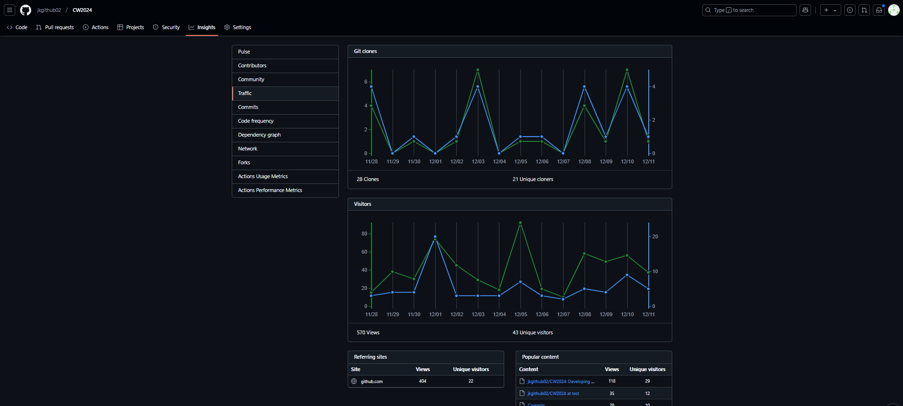

# COMP2042 Developing Maintainable Software

---
## <ins>1.0 My Github</ins>
**Name:** Jason Kong <br>
**Student ID:** 20615244 <br>
**Link:** https://github.com/jkgithub02/CW2024

---

## <ins>2.0 Setup and Compilation Instructions</ins>
### <ins>2.1 Prerequisites

- Java Development Kit (JDK) 21 or later
- Apache Maven 3.9.0 or later
- JavaFX SDK 21 or later
- Git (for cloning the repository)

#### <ins>Recommended IDEs
- IntelliJ IDEA 2023.3+
- IntelliJ IDEA Community Edition 2023.3+
- Eclipse 2023-12+
- VS Code with Java Extension Pack

#### <ins>Environment Setup
1. **Install Java Development Kit (JDK)**
    - Download and install JDK 21 from [Oracle](https://www.oracle.com/java/technologies/downloads/) or use OpenJDK
    - Follow this tutorial link: https://www.makeuseof.com/java-home-variable-windows-11/
    - Set JAVA_HOME environment variable or add to system PATH:
      ```bash
      # Windows
      [Environment]::SetEnvironmentVariable("JAVA_HOME", "C:\Program Files\Java\jdk-21", "Machine")
      [Environment]::SetEnvironmentVariable("Path", $env:Path + ";%JAVA_HOME%\bin", "Machine")
 
      # Unix/MacOS
      echo 'export JAVA_HOME=/Library/Java/JavaVirtualMachines/jdk-21.jdk/Contents/Home' >> ~/.bash_profile
      echo 'export PATH=$JAVA_HOME/bin:$PATH' >> ~/.bash_profile
      source ~/.bash_profile
      ```
    - Verify Java installation:
      ```bash
      java --version
      # Should show Java 21 or higher
      ```

2. **Install JavaFX SDK**
    - Download JavaFX SDK 21 from [OpenJFX](https://gluonhq.com/products/javafx/)
    - Extract to a preferred location
    - Add to PATH (optional, as Maven will handle dependencies):
      ```bash
      # Windows
      [Environment]::SetEnvironmentVariable("PATH_TO_FX", "C:\Path\To\javafx-sdk-21\lib", "Machine")
 
      # Unix/MacOS
      echo 'export PATH_TO_FX=/path/to/javafx-sdk-21/lib' >> ~/.bash_profile
      source ~/.bash_profile
      ```

3. **Install Git**
    - Windows: Download and install from [Git for Windows](https://gitforwindows.org/)
    - macOS: Install via Homebrew: `brew install git`
    - Linux: `sudo apt-get install git` (Ubuntu/Debian) or `sudo dnf install git` (Fedora)
    - Verify installation:
      ```bash
      git --version
      ```

4. **Install Apache Maven**
    - Download from [Maven Official Site](https://maven.apache.org/download.cgi)
    - Add Maven to your PATH
    - Verify installation:
      ```bash
      mvn --version
      ```
###
**NOTE:** <br>
<i>While JavaFX SDK installation is listed, it's not strictly required for this project as Maven will handle the JavaFX dependencies automatically through the pom.xml configuration. However, having it installed locally can be useful for development and troubleshooting. </i>

### <ins>2.2 Project Setup

1. **Clone the Repository**
   ```bash
   git clone https://github.com/jkgithub02/CW2024.git
   cd CW2024
    ```
###   
2. **IDE Setup**
   - Eclipse 
     - Import as Maven project 
     - Right-click project → Properties → Java Build Path 
     - Add JavaFX libraries if needed
   - IntelliJ IDEA /
     - Import as Maven project 
     - Ensure Project SDK is set to JDK 21
     - Refresh Maven project to load dependencies
     - Wait for Maven Sync
   - VS Code
     - Install Java Extension Pack
     - Install JavaFX Extension
     - Open project folder
     - Run using Maven commands or create launch configuration
###
3. **Compile and Run**
    - Compile using Maven:
      ```bash
      mvn clean compile
      ```
    - Run the application:
      ```bash
      mvn javafx:run
      ```
    - Package the application:
      ```bash
      mvn package
      ```
    - Run the packaged JAR file:
      ```bash
      java -jar target/CW2024-1.0-SNAPSHOT.jar
      ```
###
### <ins>2.3 Common Build Commands</ins>
```bash
    # Clean build files
    mvn clean

    # Compile project
    mvn compile

    # Run tests
    mvn test

    # Package application
    mvn package

    # Install to local repository
    mvn install

    # Run application
    mvn javafx:run
   ```
---

## <ins>3.0 Features</ins>
### <ins>3.1 Implemented and Working Properly</ins>
#### 1. Added left-right movement for the user plane.
- Implemented in `InputManager` and `UserPlane` classes with horizontal velocity multiplier (±2)
- Includes bounds checking via `X_LOWER_BOUND` and `X_UPPER_BOUND` constants
#### 2. Added a main menu upon game startup.
- Implemented through FXML with `MainMenuController`, following the Model-View-Controller (MVC) pattern
- Features two game modes, a leaderboard page and settings options
#### 3. Created a pause menu with its handler.
- `PauseManager` class handles pause functionality with ESC key
- Implements resume, restart, and return to main menu options
- Uses FXML for UI with scene management
#### 4. Added a kill count label to track kills.
- Implemented in `LevelView` with `KillCountDisplay`
- Updated through `updateKillCount()` method
- Tracks kills through `UserPlane.incrementKillCount()`
#### 5. Added background images, changed the hearts icon, and added background music.
- `SoundManager` handles background music for each scene
- Implemented volume control for background music
- Includes custom heart icons and background images for new and existing levels
#### 6. Added one additional level (Level 2).
- Extends `LevelParent` class
- Includes increased enemy plane difficulty scaling
- Transitions handled by `NavigationManager`
#### 7. Added a new enemy plane (EnemyPlaneTwo).
- Extends `FighterPlane` class with increased health (2 HP)
- Increased fire rate (3% per frame)
#### 8. Added arcade mode and leaderboard mechanics.
- `ArcadeLevel` class implements endless mode with wave-based progression and increasing difficulty
- `LeaderboardManager` tracks and displays top scores
#### 9. Added game over and win screens using FXML and controllers.
- `GameOverController` and `WinScreenController` manage game over and win screens
- Includes restart level (GameOverController), restart game (WinScreenController) and return to main menu options
#### 10. Allowed users to restart levels or games from various screens.
- Restart capability from pause menu, game over screen and win screen
- Implemented through `NavigationManager.restartLevel()`
- State preservation during restarts
#### 11. Added a leaderboard that sorts and shows the highest scores.
- Sorts scores in descending order
- Limited to top 10 scores
- Persistent storage in arcade_scores.txt
#### 12. Added sound effects for taking damage and firing projectiles.
- Different sounds for shooting, damage, victory and game over
- Volume control through settings
- Managed by `SoundManager` singleton
#### 13. Added a health bar for the boss plane.
- Visual health indicator for boss fights
- Updates dynamically with damage taken
- Implemented in boss-specific UI elements
#### 14. Added a settings page to adjust music and sound effects volume.
- Volume controls for music and effects
- Settings persistence throughout gameplay
- Accessible from main menu
#### 15. Added a level transition screen with fade effects.
- `LevelTransitionScreen` class manages level transitions
- Includes fade animations for smooth transitions
- Displays level names with styled text
#### 16. Settings page can now adjust key bindings.
- `KeyBindingsManager` class manages key bindings
- Allows remapping of controls with duplicate prevention
- Persists key bindings through Java Preferences API
#### 17. Added destruction effects for the user plane and enemy planes.
- `DestructionSprite` class handles explosion animations
- Visual feedback for destroyed planes
- Includes collision and projectile kill effects, Managed through `DestructionType` enum
#### 18. Added a bullet display to show the user's remaining bullets and reload system.
- Shows current ammunition count
- Visual reload progress indicator
- Managed by `BulletDisplay` class
#### 19. Styled fxml files with CSS.
- Custom styling for UI elements
- Improved visual appeal and consistency
- Consistent theme across FXML files

### <ins>3.2 Implemented but Not Working Properly</ins>
#### 1. GameOver, Win Screens and reload audio clips may overlap
- Issue: Audio clips may overlap when transitioning between screens
- Does not affect functionality, and can be managed with proper audio queue management
#### 2. Users can simultaneously press two key binding buttons while registering controls
- `KeyBindingsManager` allows simultaneous key registration
- However, the current partial solution is no keys will be registered if both buttons are pressed simultaneously

### <ins>3.3 Not Implemented</ins>
#### 1. Mini health bar for enemies.
Reason: 
- Would require significant modifications to FighterPlane class
- Additional UI overhead for multiple enemy instances
- Time constraints in implementing dynamic health display system
#### 2. In Game Power-ups.
Reason:
- Complex collision detection system required
- Need for power-up effect management system
- Time constraints in designing balanced power-up mechanics
#### 3. Display user final score in gameover screen during the arcade level.
Reason:
- Score tracking exists but not integrated with game over screen
- Would require modifications to GameOverController and FXML layout
- Does not affect core gameplay or functionality

---

## <ins>4.0 Refactoring Process</ins>
### <ins>4.1 New Java Classes</ins>
#### <ins>4.1.1 Actors</ins>
| Class Name | Description |
|------------|-------------|
| `DestructionType` | Enum class defining different types of destruction events in the game (collision, projectile kill, defense penetration). |
###
#### <ins>4.1.2 Actors/Factory</ins>
| Class Name             | Description                                                                                                                                                                                    |
|------------------------|------------------------------------------------------------------------------------------------------------------------------------------------------------------------------------------------|
| `ActorFactory`         | Interface defining the contract for creating game actors with a single method for actor creation at specified coordinates.                                                                     |
| `AbstractActorFactory` | Abstract base class implementing ActorFactory, providing common functionality for actor creation with configurable image heights.                                                              |
| `EnemyFactory`         | Factory class implementing creation of different enemy types (EnemyPlane, EnemyPlaneTwo, Boss) with specific configurations for each enemy variant. Includes an enum for enemy type selection. |
| `ProjectileFactory`    | Factory class managing creation of different projectile types (User, Enemy, Boss) with varying characteristics and image heights. Uses enum-based type selection for projectile creation.      |

###
#### <ins>4.1.3 Actors/Planes</ins>
| Class Name      | Description                                                                                                                                                                                                                                   |
|-----------------|-----------------------------------------------------------------------------------------------------------------------------------------------------------------------------------------------------------------------------------------------|
| `EnemyPlaneTwo` | Advanced enemy plane type for level two featuring increased health (2 HP), consistent horizontal movement, and projectile firing capabilities with a 3% fire rate per frame. Utilizes ProjectileFactory for standardized projectile creation. |

###
#### <ins>4.1.4 Config</ins>
| Class Name    | Description                                                                         |
|---------------|-------------------------------------------------------------------------------------|
| `GameConfig`  | Contains game-wide configuration constants (screen dimensions, player stats, etc.). |
| `GameState`   | Enum defining different game states (ACTIVE, PAUSED, WIN, LOSE).                    |

###
#### <ins>4.1.5 Controller</ins>
| Class Name              | Description                                                                                                                                                            |
|-------------------------|------------------------------------------------------------------------------------------------------------------------------------------------------------------------|
| `LeaderboardController` | Handles the leaderboard display system, showing top 5 scores with formatted display, background music control, and navigation features.                                |
| `MainMenuController`    | Core menu controller managing game mode selection (Story/Arcade), settings access, leaderboard viewing, and background music with dynamic UI layout.                   |
| `SettingsController`    | Manages game settings including background music and sound effects volume controls with real-time adjustment and key bindings controls preferences.                    |

###
#### <ins>4.1.6 Controller/GameControllers</ins>
| Class Name              | Description                                                                                                                                                            |
|-------------------------|------------------------------------------------------------------------------------------------------------------------------------------------------------------------|
| `ArcadeModeController`  | Manages the arcade game mode functionality, handling initialization and launch of endless gameplay sessions with SoundManager integration.                             |
| `GameOverController`    | Manages the game over screen interface, providing options to restart the current level or return to the main menu using NavigationManager.                             |
| `PauseMenuController`   | Controls the in-game pause functionality with options to resume, restart, or exit to main menu, featuring a semi-transparent overlay and configurable action handlers. |
| `WinScreenController`   | Handles the victory screen interface, providing options to restart from the first level or return to main menu with proper navigation management.                      |

###
#### <ins>4.1.7 Levels</ins>
| Class Name    | Description                                                                                                                                                                                                                               |
|---------------|-------------------------------------------------------------------------------------------------------------------------------------------------------------------------------------------------------------------------------------------|
| `ArcadeLevel` | Implements an endless arcade mode featuring wave-based progression with dynamic difficulty scaling. Includes increasing spawn rates (0.25 to 0.75), enemy count scaling (5 to 8 maximum), and leaderboard integration for score tracking. |
| `LevelTwo`    | Second level of the story mode requiring 10 kills to advance, featuring enhanced enemy types. Implements a 20% spawn probability system with a maximum of 7 concurrent enemies.                                                           |

###
#### <ins>4.1.8 Managers</ins>
| Class Name           | Description                                                                                                                                                                                                                 |
|----------------------|-----------------------------------------------------------------------------------------------------------------------------------------------------------------------------------------------------------------------------|
| `BulletManager`      | Manages ammunition system with configurable magazine size and reload mechanics. Features automatic reload timers, reload sound effects, and bullet pause/resume functionality for game state handling.                      |
| `CollisionManager`   | Handles collision detection between game entities (planes, projectiles) with specialized handling for different collision types. Integrates with SoundManager for impact audio feedback.                                    |
| `EntityManager`      | Singleton class managing game entity lifecycles including friendly/enemy units and projectiles. Provides centralized entity tracking, updates, and destruction handling with observer pattern for enemy defeats.            |
| `GameInitializer`    | Coordinates game initialization process, setting up background, UI elements, pause functionality, and core game components. Manages scene setup and initial game state configuration.                                       |
| `InputManager`       | Processes user input for player movement and actions, managing key press states and projectile firing. Implements game state-aware control system with pause functionality.                                                 |
| `PauseManager`       | Implements game pause functionality with UI overlay, handling pause/resume states and menu options. Manages ESCAPE key detection and pause menu display.                                                                    |

###
#### <ins>4.1.9 Managers/GameManagers</ins>
| Class Name           | Description                                                                                                                                                                                                                 |
|----------------------|-----------------------------------------------------------------------------------------------------------------------------------------------------------------------------------------------------------------------------|
| `KeyBindingsManager` | Singleton class managing keyboard control bindings with persistent storage. Features default bindings setup, key remapping functionality, duplicate binding prevention, and preferences storage using Java Preferences API. |
| `LeaderboardManager` | Manages arcade mode high scores with persistent storage, maintaining top scores in descending order. Provides score loading, saving, and retrieval functionality.                                                           |
| `NavigationManager`  | Controls navigation between game screens (menus, levels, win/lose screens) with error handling and scene management. Manages level transitions and screen controller initialization.                                        |
| `SoundManager`       | Singleton class managing audio systems including background music and sound effects. Features volume control, sound caching, and multiple audio channel management for different game events.                               |


###
#### <ins>4.1.10 View</ins>
| Class Name               | Description                                                                                                                                                                                                                 |
|--------------------------|-----------------------------------------------------------------------------------------------------------------------------------------------------------------------------------------------------------------------------|
| `BulletDisplay`          | UI component showing ammunition status with bullet count and reload progress bar. Implements dynamic reload animation and status text using styled JavaFX elements.                                                         |
| `KillCountDisplay`       | Base class for kill count visualization with configurable positioning and formatting. Uses styled labels for consistent text display.                                                                                       |


###
#### <ins>4.1.11 View/Arcade</ins>
| Class Name               | Description                                                                                                                                                                                                                 |
|--------------------------|-----------------------------------------------------------------------------------------------------------------------------------------------------------------------------------------------------------------------------|
| `ArcadeKillCountDisplay` | Specialized display component for arcade mode score tracking, extending KillCountDisplay with custom "Score: X" formatting instead of the standard kill counter.                                                            |
| `ArcadeLevelView`        | Extended view class for arcade mode UI, managing score display positioning and custom kill count visualization.                                                                                                             |

###
#### <ins>4.1.12 View/BossLevel</ins>
| Class Name               | Description                                                                                                                                                                                                                 |
|--------------------------|-----------------------------------------------------------------------------------------------------------------------------------------------------------------------------------------------------------------------------|
| `BossHealthBar`          | Visual component displaying boss health status using a styled progress bar with color-coded health representation and numerical overlay. Features dynamic health percentage calculation.                                    |


###
#### <ins>4.1.13 View/Effects</ins>
| Class Name               | Description                                                                                                                                                                                                                 |
|--------------------------|-----------------------------------------------------------------------------------------------------------------------------------------------------------------------------------------------------------------------------|
| `DestructionSprite`      | Handles explosion animation effects using sprite sheets, featuring 9-frame animation sequence with configurable sprite size (150px) and refresh rate (100ms).                                                               |
| `LevelTransitionScreen`  | Manages level transition effects with fade animations (2-second duration), displaying styled level names against black background.                                                                                          |


## <ins>4.2 Modified Java Classes</ins>
1. `ActiveActorDestructible.java`:
   - Added `DestructionType` functionality:
      - Introduced the `destructionType` field to handle different types of destruction
      - Added an overloaded `destroy(DestructionType type)` method to specify destruction types
###
2. `Boss.java`:
   - Changed projectile offset
   - Changed Y lower and upper bounds to prevent off-screen movement
   - Added getter methods for health and shield status
   - Implemented `ProjectileFactory`
      - Utilized ProjectileFactory for creating projectiles, enhancing code reusability and modularity
###
3. `FighterPlane.java`:
   - Added destruction effects in method `playDestructionEffect()`
   - Modified `destroy()` method to play destruction effects

###
4. `EnemyPlane.java`:
   - Implemented `ProjectileFactory`
      - Utilized ProjectileFactory for creating projectiles, enhancing code reusability and modularity

###
5. `LevelOne.java`:
   - Refactored Constructor:
      - Removed screenHeight and screenWidth parameters; now relies on parent class or configuration for screen dimensions
      - Used `GameConfig.PLAYER_INITIAL_HEALTH` instead of a local constant for player health
      - Initialized `EnemyFactory` for enemy creation, applying the Factory design pattern

   - Adjusted Enemy Spawning:
      - Introduced `ENEMY_Y_UPPER_BOUND` to prevent enemies from spawning too close to the top edge

   - Updated enemy creation to use `enemyFactory` instead of direct instantiation
   - Updated Level Transition Logic:
      - Added `NEXT_LEVEL_NAME` for better level identification during transitions
   - Updated `instantiateLevelView()` to pass additional parameters like `KILLS_TO_ADVANCE` and `GameConfig.PLAYER_MAX_BULLETS`

###
6. `LevelParent.java`:
   - Removed `Observable` Inheritance:
      - Reason: The `Observable` class was deprecated in Java 9, as pointed out in this resource: https://stackoverflow.com/questions/46380073/observer-is-deprecated-in-java-9-what-should-we-use-instead-of-it
      - Change: Removed the inheritance from `Observable` and replaced it with listener-based implementations.
      - Impact: Improved compatibility with newer Java versions and adopted a more modern and flexible event-handling mechanism.
   - Refactored Code Structure:
      - Introduced manager classes to follow single-responsibility principle:
         - `EntityManager, InputManager, CollisionManager, PauseManager, NavigationManager, GameInitializer, SoundManager`
         - Impact: Improved code modularity, readability, and maintainability by delegating specific responsibilities to dedicated classes
      - Enhanced Input Handling:
         - Replaced direct event handlers with an `InputManager` and Set<KeyCode> to manage user inputs.
         - Impact: Allows for more flexible and scalable input processing.
      - Centralized Entity Management:
         - Replaced individual lists for entities with an `EntityManager` singleton.
         - Impact: Streamlined entity updates, additions, and removals.
      - Implemented Collision Management:
         - Added a `CollisionManager` to handle all collision detections and resolutions.
         - Impact: Encapsulated collision logic, improving separation of concerns.
      - Added Pause and Navigation Features:
         - Integrated `PauseManager` to manage game pausing and resuming.
      - Included `NavigationManager` for scene transitions (e.g., main menu, game over screen).
         - Impact: Enhanced user experience with pause functionality and smoother navigation.
      - Sound Integration:
         - Incorporated `SoundManager` to play background music and sound effects.
         - Impact: Improved game immersion through audio feedback.
      - State Management with `GameState`:
         - Utilized `GameState` enum to represent different game states (e.g., `ACTIVE, PAUSED, WIN, LOSE`).
         - Impact: Simplified state-dependent logic and transitions.
      - Global Root Handling:
         - Added static methods `setGlobalRoot()` and `getGlobalRoot()`.
         - Impact: Allows global access to the root node, facilitating shared resources among classes.

###
7. `LevelTwo.java`:
   - Renamed to `LevelBoss.java`:
   - Refactored Constructor:
      - Used `GameConfig.PLAYER_INITIAL_HEALTH` instead of a local constant for player health
      - Uses an `EnemyFactory` to create instances of the boss (`Boss`)
   - Updated enemy creation to use `enemyFactory` instead of direct instantiation
   - Overrides `updateLevelView()` to update the boss's health bar and shield visibility based on the boss's current state
   - Fixed `ShieldImage` not showing issue in the boss level
   - Added `addShieldImage()` and `addHealthBar()` methods to incorporate new visual elements.

###
8. `LevelView.java`:
   - Introduced `KillCountDisplay` and `BulletDisplay` classes to show the player's kill count and bullet status
   - Added constants for positioning `KillCountDisplay` and `BulletDisplay` elements
   - Constructor now accepts additional parameters `maxKills` and `maxBullets` to initialize the new displays
   - Updated the position of the heart display to the top center of the screen
   - Removed Game Over and Win screens from `LevelView` and moved them to separate FXML files
   - Provided methods to update the kill count and bullet status during gameplay, offering real-time feedback to the player

###
9. `LevelViewLevelTwo.java`:
    - Renamed to `LevelBossView.java`:
    - Added parameters `maxKills` and `maxBullets` to align with parent class changes
    - Maintains consistency with the enhanced `LevelView` parent class
    - Introduced `BossHealthBar` component to display boss health and added new constants for health bar positioning and configuration
    - Shield showing functionality moved to the `LevelBoss` class for better separation of concerns
    - Added method overrides to prevent kill count display in boss level to replace with boss health bar instead

###
10. `ShieldImage.java`:
    - Fixed NullPointerException from wrong shieldImage name (`.jpg` to `.png`)

###
11. `UserPlane.java`:
    - Enhanced Movement System:
      - Implemented horizontal movement
      - Introduced separate velocity controls for horizontal and vertical movement
      - Added X-axis movement bounds
    - Bullet Management:
      - Implemented a bullet cooldown system to limit the rate of fire
      - Added a bullet limit to prevent excessive firing
      - Updated bullet firing logic to use the `BulletManager` for bullet creation
    - Factory Pattern Implementation:
      - Utilized `ProjectileFactory` for creating projectiles, enhancing code reusability and modularity
    - Implemented `startAnimation()` method for smooth movement updates

###
12. `Controller.java`:
    - Renamed to `GameController.java` to reflect its role more accurately
    - Removed `Observer` interface implementation due to deprecation in Java 9+ 
    - Replaced Observable/Observer pattern with property listeners in `startLevel()` method
    - Added level display name field, `START_LEVEL_DISPLAY_NAME` for initial level transition screen
    - Simplified constructor parameters by removing dependencies on stage dimensions

###
13. `Main.java`:
   - Moved configuration values such as `SCREEN_WIDTH`, `SCREEN_HEIGHT` and `TITLE` to dedicated `GameConfig` class
   - Implemented FXML-based UI structure and added main menu screen `MenuScreen.fxml`
   - Introduced dedicated menu controller `MainMenuController` for handling menu interactions

###
14. `GameOverImage.java`:
   - Replaced with FXML file `GameOverScreen.fxml` and controller class `GameOverController.java`
   - Followed the architecture and practice of Model View Controller (MVC) pattern

###
15. `WinImage.java`:
   - Replaced with FXML file `WinScreen.fxml` and controller class `WinController.java`
   - Followed the architecture and practice of Model View Controller (MVC) pattern

## <ins>4.3 Summary and Additional notes of Refactoring Process</ins>
#### 1. Fixed NullPointerException from wrong shieldImage name.
- Issue: The shield image was not showing due to an incorrect file extension.
- Solution: Renamed the shield image file from `.jpg` to `.png` to match the actual file extension.
#### 2. Adjusted projectile firing offset.
- Issue: Projectiles were not firing from the correct position.
- Solution: Updated the projectile firing offset to align with all plane's position.
#### 3. Replaced observer and observable implementations with listeners.
- Issue: The `Observer` interface was deprecated in Java 9, leading to potential compatibility issues.
- Solution: Replaced the observer pattern with property listeners for more modern and flexible event handling.
#### 4. Readjusted and cropped image sizes to fix irregular hit-box issues.
- Issue: Inconsistent image sizes caused irregular hit-boxes and collision detection problems.
- Solution: Adjusted image sizes and cropping to ensure accurate hit-boxes and collision detection.
#### 5. Organized files into relevant packages.
- Issue: The project structure was disorganized, making it challenging to locate and manage files.
- Solution: Grouped classes into packages based on functionality for better organization and maintainability.
```
C:.
├───actors
│   ├───factory
│   ├───planes
│   └───projectiles
├───config
├───controller
│   └───gameControllers
├───levels
├───managers
│   └───gameManagers
└───view
    ├───arcade
    ├───bosslevel
    └───effects

```
#### 6. Deleted redundant code / code smells.
- Issue: For example, in the original codebase, `showShield()` and `hideShield()` methods in `LevelViewLevelTwo` had no usages
- Solution: Removed redundant methods and unused code to improve code readability and maintainability.
#### 7. Fixed shield not showing issue in the boss level.
- Issue: The shield was not displaying correctly in the boss level.
- Solution: Moved the shield showing functionality to the `LevelBoss` class for better separation of concerns.
#### 8. Refactored LevelParent class.
- Issue: The `LevelParent` class had multiple responsibilities, violating the single responsibility principle.
- Solution: Introduced manager classes to handle specific responsibilities like entity management, input handling, and collision detection.
#### 8. Fixed kill count issue with collisions and penetrations.
- Issue: The kill count was not updating correctly when enemies were destroyed, regardless of destruction cause (penetration, collision and projectile kill).
- Solution: Updated `CollisionManager` to handle different destruction types and trigger kill count updates accordingly.                                                                                                                         
#### 9. Implemented factory design patterns for actors.
- Issue: The original codebase had direct instantiation of actors, leading to tight coupling and reduced flexibility.
- Solution: Introduced `ActorFactory` and `AbstractActorFactory` to create actors with configurable properties, enhancing code reusability and modularity.
#### 10. Extracted game configurations.
- Issue: Configuration values were scattered throughout the codebase, making it challenging to manage and update them.
- Solution: Centralized game configurations in the `GameConfig` class for easy access and modification.
#### 11. Fixed plane drifting issue after timeline stops.
- Issue: Planes continued to drift after the timeline stopped, leading to unintended movement.
- Solution: Implemented a Game State-aware control system to prevent movement during pause states.
#### 12. Applied singleton design pattern to `soundmanager` ,`entitymanager` and `keybindingsmanager`.
- Issue: Multiple instances of these classes could lead to inconsistent behavior and resource wastage.
- Solution: Implemented the singleton pattern to ensure a single instance of these classes throughout the application.

#### 13. Development was done in a separate branch and merged into the main branch after testing.
- Issue: Direct development on the main branch could lead to conflicts and issues with the existing codebase.
- Solution: Created a separate development branch called `test` for feature implementation and testing before merging into main branch.

#### 14. Implemented FXML-based UI structure.
- Issue: The original codebase had UI elements mixed with Java code, making it challenging to maintain and update the UI.
- Solution: Introduced FXML files for UI layout and controllers for handling UI interactions, following the Model-View-Controller (MVC) pattern.

#### 15. Tested and verified the refactored codebase for functionality and performance.
- Issue: Refactored code could introduce new bugs or performance issues.
- Solution: Conducted thorough unit-testing and integration testing to ensure the refactored codebase works as intended, following the test-driven development (TDD) approach.

### 
For a detailed commit history, please refer to the [commit log](https://github.com/jkgithub02/CW2024/commits "View full commit history").
---

## <ins>5.0 Unexpected Problems</ins>
1. Time Management
- Concurrent deadlines with other module assignments and assessments created scheduling pressure
- Extracurricular activities and commitments required careful planning
- Resolution:
   - Implemented strict development schedule with clear goals
   - Prioritized core gameplay features before additional enhancements
   - Fully utilized weekends for focused development and refactoring
2. Git Merge Conflicts
- Encountered significant merge conflicts between test and main branches
- Nearly lost codebase during merge conflict resolution due to incorrect code comparison acceptance
- Resolution:
  - Aborted problematic merge using git merge --abort
  - Created backup branch before attempting subsequent merges
  - Reinitiated merge into main branch from test branch with careful review
3. Github Suspicious Activity

   
- Detected unusual repository traffic through GitHub Insights
- Multiple clone attempts from unknown sources
- Potential plagiarism concerns raised by traffic patterns
- Resolution:
  - Informed module coordinator of suspicious activity
  - Included screenshots of traffic patterns and repository access logs

4. FXML Directory Issue 
- Main Menu FXML file was not being detected by the application
- Cause is unknown despite multiple attempts at debugging and verifying file paths
- Resolution:
  - Placed Main Menu FXML file in the base resources directory for the application